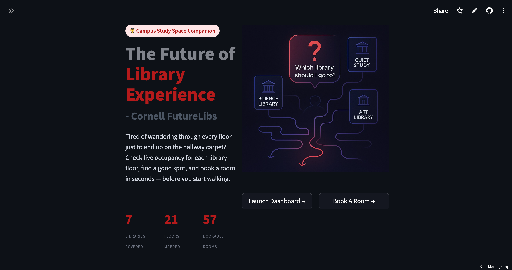
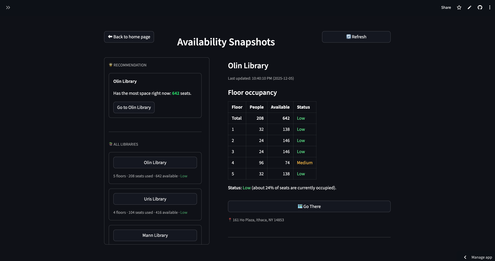
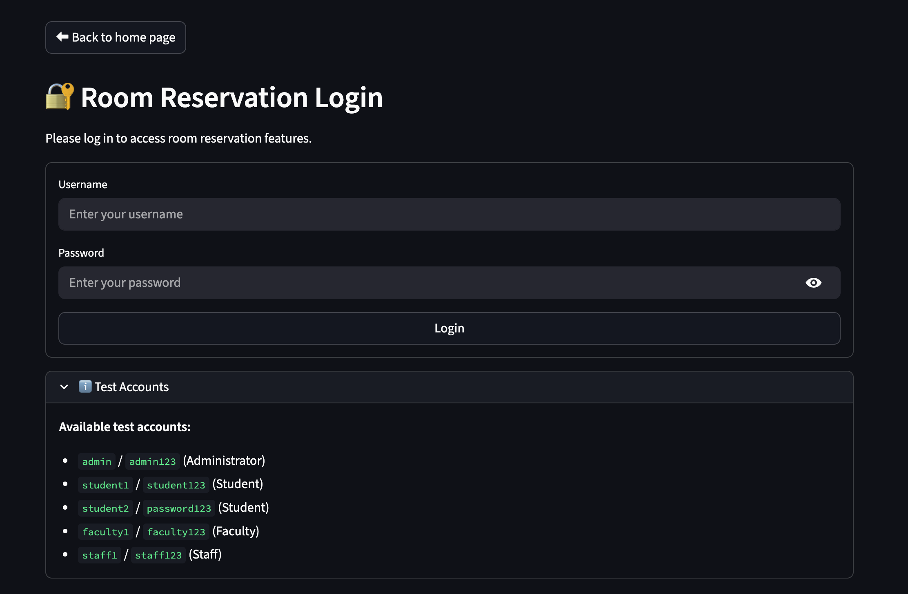
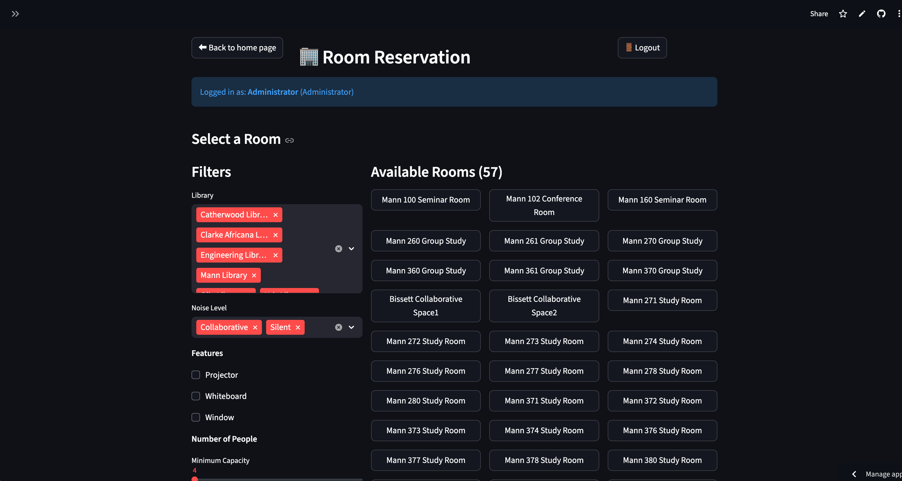
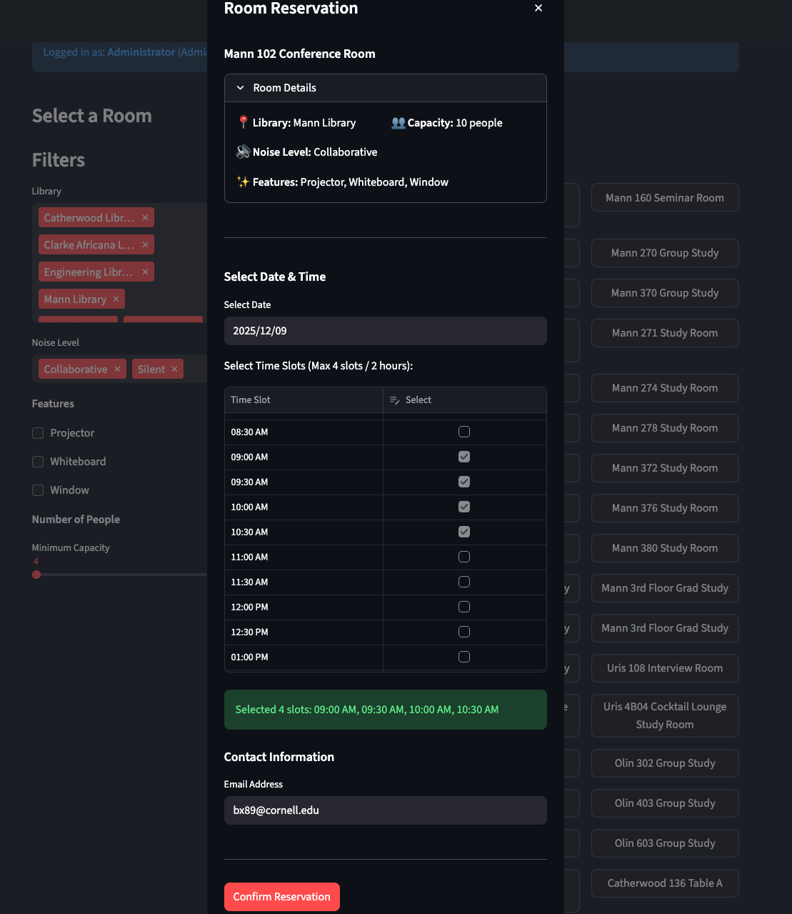

<h1 align="center">Cornell FutureLibs</h1>
<p align="center">A real-time library occupancy & room booking dashboard</p>

<p align="center">SYSEN 5151 TEAM 10</p>
<p align="center">Siyu Yao | Ruoxi Wang | Zian Liu | Kemeng Wu | Yinan Yu | Raymond Xu </p>

## 1 Introduction
Cornell FutureLibs is a web dashboard that reports real-time occupancy status of each library and each floor by analyzing libraries' surveillance camera feeds with YOLO people detection model. It also includes a simple room-booking interface so students can plan group study sessions without endless group chats.

> ⚠️ **Important Note – Demo Data Only**  
> Due to lack of hardware resources for large scale parallel video processing, privacy constraints and lack of access to real camera feeds and live library systems, this project **does not** use real surveillance footage or real-time library data.  
> Instead, we use **AI-generated camera feed images**  to run object detection and estimate floor occupancy data to demonstrate the **technical feasibility** of the approach. The current version is a proof-of-concept prototype, not a production deployment.

### 🔍 Key Features

- **Live library occupancy by floor**  
  - Uses YOLO-based people counting on camera feeds.  
  - Aggregates per-library and per-floor occupancy.

- **Floor-level status indicators**  
  - Quickly see which floors are quiet, moderate, or crowded.

- **Library recommendation view**  
  - “Recommendation” tab that surfaces libraries with the most available space.

- **Basic room booking interface**  
  - Browse rooms by library and features.  
  - Create bookings with time, room, and group size.  

- **Designed for students**  
  - Focused on reducing time wasted wandering between libraries.  
  - Simple “Launch Dashboard → Pick Library → Pick Floor / Room” flow.

## 2 Project Structure
```
library-seat-tracking/
├── .devcontainer/                 # Streamlit Deployment Configs
├── data/                          # Data Storage Folder
│   ├── images/                    # Front Page Pictures
│   ├── lib_images/                # AI-Generated Images for Demo                     
│   ├── credentials.csv            # Authenticated Log-in Credentials
│   ├── library_occupancy.csv      # Library Occupancy Data (updated when app is running)
│   └── library_rooms.csv          # Library Rooms Information
├── GUI/                           # App Folder
│   ├── app.py                     # Main App Script
│   └── pages/                     # Tabs in App
│       ├── 1_Availability.py      # Occupancy Dashboard Page
│       └── 2_RoomReservation.py   # Room Reservation Page
├── models/                        # Weight of Pre-trained YOLO11n Model
├── src/                           # Backend Modules Folder
│   ├── lib_configs.py             # Library Information
│   ├── people_counter.py          # Image Processing with Ultralytics YOLO
│   ├── rand_gen.py                # Initial Occupancy Data Generation
│   ├── real_time_gen_deploy.py    # Real-time Occupancy data Generator Deploy Version(Used at Early Phase, Now Replaced by people_counter.py)
│   └── real_time_gen.py           # Real-time Occupancy data Generator (Used at Early Phase, Now Replaced by people_counter.py)
├── .gitignore
├── FutureLibs.ipynb               # Introduction Notebook
├── README.md                      # README
├── requirements.txt               # Required Packages
├── setup.sh                       # Setup Script for Virtual Environment Creation and Dependencies Installation               
└── setup_gitbash.sh               # Setup Script for Git Bash Terminal Users

```

## 3 Dashboard Usage

### Link Access
`https://raymondbrxu-library-seat-tracking-guiapp-a8k95e.streamlit.app/`

Use above link to access the dashboard prototype.

Note: The dashboard is deployed on streamlit community cloud which is free of charge, therefore the app will be terminated after a long period of inactivity. Please email me at bx89@cornell.edu if you are not able to access the dashboard so that I can reboot the app with a click of mouse, thank you!

### Local Deployment

First clone the repository:
```bash
git clone https://github.com/raymondBRXu/library-seat-tracking.git

cd library-seat-tracking # Use the correct path on your device
```

Run setup script: 

```bash
source setup.sh
```
Or run

```bash
source setup_gitbash.sh
```
if you are running on Windows Git Bash Terminal

Run the Dashboard:
```bash
streamlit run GUI/app.py
```

### How to Use it?

Click Launch Dashboard to see occupancy status. The data is updated every 5 seconds, please click refresh at least 5 seconds after launching to see an updated number. 


Click on a library you want to go, click Go There, and you will be prompted to a Google Map Page for navigation.



Click Boom A Room at home page, use one of the test accounts to log in.


Adjust the filters based on your requirements, and click on a room to book.


Select a date in next 7 days, and pick at most 4 time slots to book (Each slot represents the start time and has 30 minutes period). Enter your email address and click Confirm Booking to lock your room. An email will be sent to your inbox shortly.



